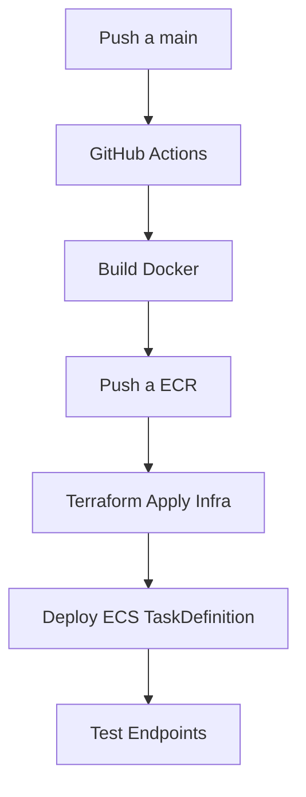

# 🛡️ Microservicio de Autenticación con Spring WebFlux + CI/CD AWS

Este proyecto implementa un microservicio **reactivo** de autenticación utilizando Spring WebFlux, arquitectura hexagonal, seguridad con JWT, persistencia en PostgreSQL, despliegue en Docker, y orquestación completa con GitHub Actions, Terraform, ECR y ECS.

---

## 📐 Arquitectura General

```txt
┌────────────┐    HTTP     ┌────────────────────┐    ┌─────────────┐
│  Cliente   ├───────────►│ API Gateway (ECS)   ├───►│ Spring WebFlux │
└────────────┘            └────────────────────┘    └─────┬───────┘
                                                          ▼
                                                  ┌──────────────┐
                                                  │ PostgreSQL DB│
                                                  └──────────────┘
```

---

## ⚙️ Stack Tecnológico

| Capa | Tecnología |
|------|------------|
| Backend | Java 21 + Spring WebFlux |
| Seguridad | JWT (stateless) |
| Persistencia | PostgreSQL |
| Infraestructura | Terraform |
| Contenedores | Docker + AWS ECR |
| Orquestación | AWS ECS (Fargate) |
| CI/CD | GitHub Actions + Terraform + ECR/ECS Deploy |
| API Docs | Swagger (SpringDoc OpenAPI) |

---

## 🔐 Funcionalidades

- Registro de usuarios (`/api/auth/signup`)
- Login de usuarios (`/api/auth/signin`)
- Generación y validación de JWT
- Roles y permisos
- Validaciones reactivas
- RouterFunction en lugar de @Controller tradicional

---

## 🧪 Endpoints Principales

| Método | Endpoint | Descripción |
|--------|----------|-------------|
| `POST` | `/api/auth/signup` | Registra un nuevo usuario |
| `POST` | `/api/auth/signin` | Inicia sesión y devuelve el JWT |
| `GET` | `/api/auth/secure` | Endpoint protegido con JWT |

Swagger UI se puede acceder (si está habilitado) en `/swagger-ui.html`.

---

## 🧱 Estructura del Proyecto (Hexagonal)

```bash
src/
├── config/               # Configuración de seguridad y JWT
├── controller/           # Routers y handlers funcionales
├── service/              # Lógica de autenticación
├── repository/           # Interacción con la base de datos (ReactiveCrudRepository)
├── entities/             # Entidades JPA
├── dao/                  # DTOs de request y response
└── SecurityApplication.java # Entry Point
```

---

## 🐳 Docker

Dockerfile:
```dockerfile
FROM eclipse-temurin:21-jdk-alpine
COPY target/*.jar app.jar
ENTRYPOINT ["java", "-jar", "/app.jar"]
```

Build:
```bash
./mvnw clean package -DskipTests
docker build -t autenticacion-service .
```

---

## ☁️ GitHub Actions como Orquestador

El pipeline de GitHub Actions cumple múltiples roles:

- **Construcción de imagen Docker**
- **Autenticación con AWS ECR**
- **Push de imagen a ECR**
- **Aplicación de infraestructura con Terraform** (ECS, Load Balancer, VPC, etc)
- **Despliegue automático al cluster ECS**

Esto permite manejar ambientes como `dev` y `prod` según ramas.

### 🧩 Flujo de CI/CD



---

## 🌍 Infraestructura Terraform

Incluye:

- VPC con subredes públicas y privadas
- Security Groups
- RDS PostgreSQL
- ECR
- ECS Cluster y Service
- Application Load Balancer
- Variables para stage (dev/prod)

Ejemplo para aplicar:
```bash
cd terraform
terraform init
terraform apply -var="environment=dev"
```

---

## 🔎 Pruebas

Se ejecutan pruebas en los endpoints expuestos mediante `curl` o Postman desde GitHub Actions (`/api/auth/signin`, `/api/auth/signup`).

---

## 🚀 Despliegue

Una vez ejecutado el pipeline:

- La app estará disponible detrás de un Load Balancer de ECS
- Base de datos conectada a través de variables inyectadas por ECS (via Secrets Manager o Terraform outputs)
- Imagen Docker ejecutándose como Fargate task

---

## 👨‍💻 Autor

Paul Rivera

---

